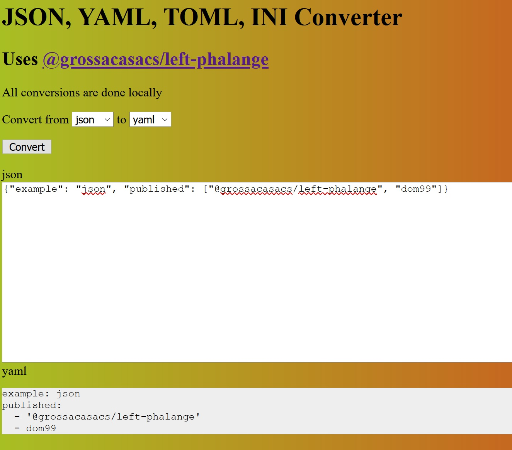

# [@grossacasacs/left-phalange](https://github.com/GrosSacASac/grossacasacs-left-phalange)

CommonJS, ESModule, INI, JSON, JSON5, TOML, YAML data loader, parser and stringifier

## Demo 

[](https://grossacasacs-left-phalange.vercel.app/)

[Source in ./ui](./ui)

## Platforms

Node, Web, Deno

## Install

[npm i @grossacasacs/left-phalange](https://www.npmjs.com/package/@grossacasacs/left-phalange)

## Usage

```js
// Node
import {parse, load, loadAsync, stringify, supportedExtensions, openedSymbol} from '@grossacasacs/left-phalange'
// Web
import {parse, stringify} from '@grossacasacs/left-phalange' // should resolve to /dist/browser.es.js
// Deno
import {parse, stringify, load, loadAsync, openedSymbol} from 'https://unpkg.com/@grossacasacs/left-phalange/dist/deno.es.js'
```

### load(file[, options])

Loading from a file

- file
  - Data file path to load
- options
  - Optional
  - Type `Object` | `String`
  - Default `{}`
- options(`String`)
  - `options.type`
- options.type
  - Data type of `file`
  - Should be one of `cjs`, `esm`, `ini`, `js`, `json`, `json5`, `toml`, `yaml`

#### examples

```js
let data = load('path/to/data');
const source = data[openedSymbol];

load('path/to/data.json')

load('path/to/data', 'yaml')

load('path/to/data', {type: 'toml'})
```


### loadAsync(file[, options])

Promise version of load

### parse(string[, options])

Parsing from a string

- string
  - type: `String`
  - string to parse
- options
  - Optional
  - Type `Object` | `String`
  - Default `{}`
- options(`String`)
  - `options.type`
- options.type
  - Data type of `string`
  - Default `yaml`
  - Should be one of `ini`, `json`, `json5`, `toml`, `yaml`

examples:

```js
parse('{"left": "phalange"}')

parse('{"left": "phalange"}', 'json')

parse('left = "phalange"', {type: 'toml'})
```

### stringify(data[, options])

Creating a string from an object

- data
  - Data to stringify
- options
  - Optional
  - Type `Object` | `String` | `Boolean`
  - Default `{}`
- options(`String`)
  - `options.type`
- options(`Boolean`)
  - `options.pretty`
- options.type
  - Data type of `string`
  - Default `json`
  - Should be one of `cjs`, `esm`, `ini`, `json`, `json5`, `yaml`, `toml`
- options.pretty
  - Pretty output
  - Default `false`

examples:

```js
stringify({left: 'phalange'})
// {"left": "phalange"}

stringify({left: 'phalange'}, 'toml')
// left = "phalange"

stringify({left: 'phalange'}, true)
// {
//   "left": "phalange"
// }

stringify({left: 'phalange'}, {type: 'json5', pretty: true})
// {
//   left: 'phalange',
// }
```

## Changelog

[Changelog](./changelog.md)


## vercel deployment config

 - build `cd ui && npm i && cd .. && npm run build`
 - output `ui/source`

## Related

- [left-phalange](https://github.com/fisker/left-phalange)

## License

MIT © 
 - [fisker Cheung](https://github.com/fisker)
 - GrosSacASac (after 2020-27-10)
